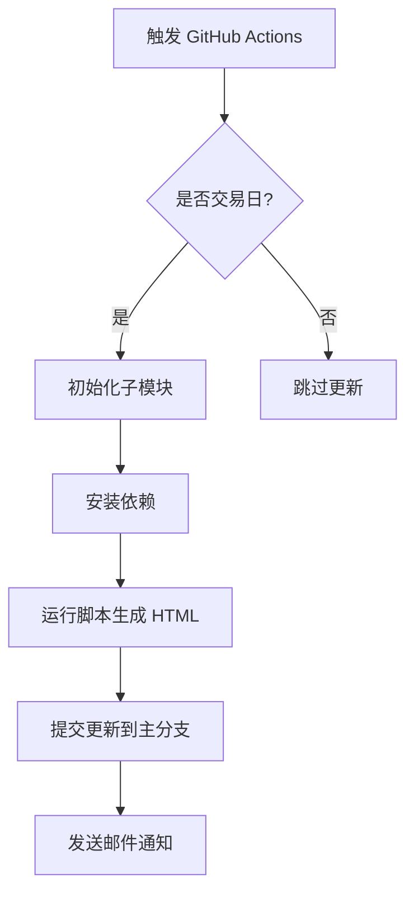

# Observe Wuyu

## 项目简介

**Observe Wuyu** 是一个基于 Python 的数据分析和可视化项目，通过自动化脚本，每晚9点半从数据库中提取数据，生成图表并更新到网页上，方便用户查看最新的市场动态。

## 功能特点

- **数据可视化**：生成成交金额占比、成交金额对比、基差等图表。
- **自动化更新**：利用 GitHub Actions，每晚自动运行脚本，确保网页内容始终保持最新。
- **邮件通知**：更新完成后，自动发送邮件通知用户。

## 技术栈

- **Python**：数据处理和图表生成。
- **SQLAlchemy**：连接 MySQL 数据库。
- **Pandas**：数据清洗与分析。
- **Pyecharts**：生成交互式图表。
- **GitHub Actions**：实现自动化更新。

## 自动化更新操作细节

### 1. GitHub Actions 配置

项目使用 GitHub Actions 实现每日自动更新，以下是主要流程：

1. **触发条件**：
   - 每天晚上 21:30（北京时间）自动触发。
   - 支持手动触发。

2. **主要步骤**：
   - **检查交易日**：通过 `check_trading.py` 脚本判断是否为交易日，非交易日跳过后续步骤。
   - **初始化子模块**：确保 `AutoEmail` 子模块被正确加载。
   - **安装依赖**：通过 `pip` 安装项目所需的 Python 包。
   - **运行脚本**：执行 `fetch_special_holidays.py` 和 `display_bench_stats.py`，生成最新的 HTML 文件。
   - **提交更新**：将生成的文件推送到主分支。
   - **邮件通知**：通过 `AutoEmail` 模块发送邮件，通知用户更新完成。

### 2. 核心文件说明

- **`.github/workflows/update.yml`**：
  定义了 GitHub Actions 的工作流，包含自动化更新的所有步骤。

- **`check_trading.py`**：
  判断当前日期是否为中国 A 股交易日。

- **`fetch_special_holidays.py`**：
  从数据库中提取特殊节假日数据，更新到本地文件。

- **`display_bench_stats.py`**：
  生成图表并更新 HTML 文件。

- **`AutoEmail` 子模块**：
  用于发送邮件通知，支持附件发送。

### 3. 环境变量配置

项目通过 `.env` 文件或 GitHub Secrets 配置敏感信息：

- **数据库连接**：
  - `SQL_PASSWORDS`：数据库密码。
  - `SQL_HOST`：数据库主机地址。

- **邮件服务**：
  - `SEND`：发件人邮箱。
  - `PASS`：发件人邮箱授权码。
  - `RECV`：收件人邮箱（支持多个，逗号分隔）。

### 4. 自动化更新流程图



## 如何运行

### 本地运行

1. 克隆项目：
   ```bash
   git clone --recurse-submodules https://github.com/Euclid-Jie/observe_wuyu.git
   cd observe_wuyu
   ```

2. 安装依赖：
   ```bash
   pip install -r requirements.txt
   ```

3. 配置环境变量：
   在项目根目录创建 `.env` 文件，填写以下内容：
   ```properties
   SQL_PASSWORDS=your_password
   SQL_HOST=your_host
   SEND=your_email
   PASS=your_email_password
   RECV=receiver_email
   ```

4. 运行脚本：
   ```bash
   python fetch_special_holidays.py
   python display_bench_stats.py
   ```

### GitHub Actions 自动运行

确保在 GitHub 仓库的 `Settings > Secrets and variables > Actions` 中配置以下 Secrets：

- `SQL_PASSWORDS`
- `SQL_HOST`
- `SEND`
- `PASS`
- `RECV`
- `REPO_TOKEN`
